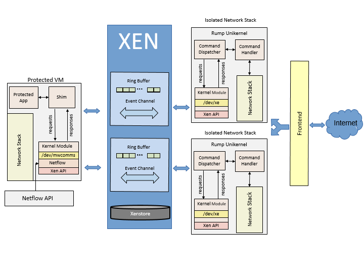

# Executive Summary of the Comms-backbone Component of MAGICWAND

\newpage

Overview
========

  []{#glossary-of-terms .anchor}Term   Definition
  ------------------------------------ ---------------------------------------------------------------------------------------------------------------------------------------------------------------------------------
  INS                                  Isolated Network Stack
  PVM                                  Protected virtual machine
  shim                                 Shared library used to intercept all socket related system calls from the protected process
  NetFlow interface                    The interface responsible for reporting all protocol stack information
  Unikernel                            A small, single address space binary application with a subset of operating system components required for the application to run as a virtual machine or on hardware directly.
  MwComms                              Shorthand used to describe parts of the MAGICWAND network isolation channel.

[]{#introduction .anchor}Table 1 Glossary of terms

Introduction {#introduction-1}
------------

Methods for Automatic Generalized Instrumentation of Components for
Wholesale Application and Network Defense (MAGICWAND) is designed to
demonstrate a groundbreaking approach to detecting low-volume,
distributed denial of service (LVDDoS) attacks delivered as part of a
protected operating environment for off-the-shelf applications and
services. MAGICWAND was developed to meet the needs of the Technical
Area 3 portion of the extreme Distributed Denial of Service (XD3) Broad
Agency Announcement. MAGICWAND can be split into two main components -
the mitigation and detection engine developed by Two Six Labs and the
Isolated Network Stack (INS) component developed by Star Lab. The scope
of this document is limited to the INS component of MAGICWAND and will
not cover other components of the MAGICWAND system, except when
referring to the parts of the system designed to interface with the
detection and mitigation engine.

Star Lab’s INS design calls for using an emerging virtualization
technology known as unikernels. unikernels are an innovation for
developing and virtualizing secure lightweight software stacks that
contain a minimal set of libraries, services, and code. The Rumprun
unikernel is a general purpose unikernel built on top of NetBSD rump
kernels and provides high quality componentized drivers, a libc, and
tools to build POSIX-like code into a Rumprun unikernel binary.
Researchers at Star Lab chose the Rumprun unikernel because the built-in
drivers and libc allow development efforts to focus on core
functionality while still providing many of the benefits of a unikernel.

For MAGICWAND, Star Lab’s INSs deploy on top of the Xen hypervisor. The
Xen hypervisor is a lightweight and secure virtualization technology
that sits between the hardware and the operating system. It provides
strong isolation between virtual machines on the same host as well as
provides a high-speed shared memory communication channel, event
notification channel, and procfs like interface to share data between
virtual machines on the same physical host. Xen is composed of a
controlling virtual machine domain called Domain 0 or Dom0, all other
unprivileged virtual machine hosts are referred to as DomU’s. Dom0 is
the host from which all commands are run to create, start, stop and
destroy Xen domains.

The MwComms isolated network channel is a system designed to intercept
all the IPv4 system calls made by a protected application and deliver
them over a shared memory communication channel to an INS. Running the
protected application in this manner allows for fine grained monitoring
of its resource consumption, usage, and retention. Additionally, running
a protected application over the isolated network stack allows real time
remote configuration of network parameters and a more diverse network
stack.

Architecture
============

The isolated network channel is comprised of six major components
depicted in Figure 1: the Xen communication interface, the protected VM,
the shim, the MwComms kernel module, the Netflow API, and the INS. The
protected VM is a Xen domain running Ubuntu 16.04. The shim is a
preloaded shared object that intercepts all network system calls from
the protected application and forwards them to the MwComms kernel
module. The kernel module labeled /dev/mwcomms in Figure 1 resides
inside the protected virtual machine and forwards all requests received
from the shim to the Xen ring buffer as well as reporting detailed
telemetry data to the Netflow API. The Netflow API is a library that
receives telemetry data via TCP socket. The Xen ring buffer is a
high-speed shared memory structure designed to facilitate high speed
communication between Xen domains. Lastly, the INSs implemented as
Rumprun unikernels receive all system calls from the protected process
and execute them then send the data from each call back to the protected
process as a response.

{width="6.520833333333333in"
height="4.020833333333333in"}

Figure 1 Isolated Network Channel Diagram

Xen Communication Interface
---------------------------

The isolated network channel uses three Xen features to enable
communication between major system components as illustrated in Figure 1
above. These features are cross domain shared memory via grant
references, the event channel, and the Xenstore. A grant table is a data
structure in each xen domain that informs Xen what permissions other
domains have to its memory. When a domain shares a page of memory with
another domain, it is done through a grant reference which is an integer
that indexes into the grant table of a particular domain. The mechanism
by which grant references are typically shared is via Xenstore, a
procfs-like interface into shared memory. Domains can place watch points
on certain directories in the Xenstore that are triggered when data is
written to them, enabling domains to synchronize the sharing of grant
table information. The final Xen communication feature is the event
channel. The event channel is an interrupt mechanism allowing
synchronous communication over the ring buffer.

Protected Virtual machine
-------------------------

The protected virtual machine (PVM) is an unprivileged domain running on
top of the Xen hypervisor. The PVM hosts the protected application, the
shared library shim as well as the MwComms kernel module which is
responsible for coordinating all system calls, sending them over the Xen
ring buffer, and providing the MAGICWAND detection and mitigation engine
with telemetry data regarding the state of the protected application’s
network stack. The isolated network channel was designed for optimal
performance with a protected VM running Ubuntu 16.04, performance with
other operating system configurations remains untested.

Shim
----

The shim transparently bypasses the operating system network stack and
sends all network system calls over the isolated network channel. A list
of system calls intercepted by the shim is depicted in Table 2 below.
The data from the system calls is converted by the shim into the custom
MwComms message structure and forwarded to the MwComms driver. In the
case of a system call needing to perform an operation on a local file
descriptor or a local socket of a type other than IPv4, the calls are
forwarded to the correct libraries for the operating system to handle
and behave as would be expected without the presence of the shim.

  Write      socket    connect    getsockopt
  ---------- --------- ---------- -------------
  Read       bind      send       Setsockopt
  Readv      listen    sendto     getsockname
  Writev     accept    recv       getpeername
  Close      accept4   recvfrom   Fcntl
  shutdown                        

[]{#mwcomms-kernel-module .anchor}Table 2 List of system calls
intercepted by shim

MwComms Kernel Module {#mwcomms-kernel-module-1}
---------------------

[]{#isolated-network-stack .anchor}The MwComms kernel module is the core
component of isolated network channel. The MwComms kernel module resides
on the protected VM and waits for an INS to start at which point it
arranges all shared memory for the ring buffer and publishes the event
channel to Xenstore enabling communication between the kernel module and
the INS. The kernel module also maintains state on every request for
error checking and operations such as replicating sockets across INS’s
as well as reporting socket information to the Netflow interface.

Isolated Network Stack {#isolated-network-stack-1}
----------------------

The Rumprun unikernel is a minimally modified NetBSD rump kernel that
can run unmodified POSIX code as a unikernel. The Rumprun unikernel was
chosen over other unikernels to act as the isolated network stack
because, as a general purpose unikernel, it has most operating system
components already built in, allowing development work to focus on core
application infrastructure instead of writing drivers and library code
that already exists. The unikernel component of the isolated network
channel is what receives all system calls forwarded by the protected
process and executes them as well as sending all return data back to the
protected process.[]{#frontend .anchor} Since the isolated network
channel can have multiple INS’s for a given protected process, each with
their own IP address, the INSs sit behind a frontend load balancer.

The frontend load balancer and orchestration script runs on Dom0 and is
responsible for creating and forwarding network traffic to the INSs. The
script operates by creating a configurable number of INSs then watching
Xenstore for the INSs to publish what ports are listening. Once the
script is notified of an INS listening on a particular port it forwards
all traffic on that port to the listening INS. When multiple INSs listen
on the same port, the frontend script will route connections to the INS
with the least number of existing active connections.

Netflow Interface
-----------------

One of the goals of the MwComms network channel is to provide telemetry
data as well as a side channel to control the behavior of socket
parameters in real time. This is accomplished through the Netflow
interface. The Netflow interface is a listening socket in the PVM kernel
module that, once connected to, receives commands to change socket
parameters and transmits telemetry data regarding the network stack. The
interface to the Netflow side channel is a python library as well as a
python command line tool for manually interacting with the Netflow
interface to view telemetry data or make changes to the network stack.

Results
=======

Performance
-----------

Performance statistics were gathered from a Dell Optiplex 9010 with an 4
core Intel(R) Core(TM) i7-3770 CPU @ 3.40GHz 32Gb DDR3 memory and a
Seagate hard drive. The performance benchmarking tool used was ab,
Apache’s HTTP benchmarking tool. Apache’s ab tool was chosen because it
is simple and can be run from the command line allowing easy integration
into testing scripts. Additionally, the web page served in the
performance tests was a small static html page consisting of only a line
of text, so more robust testing tools seemed unnecessary.

Figure 2 depicts the results of running ab against Apache HTTP Server
with and without the INS using increasing levels of concurrency from 1
to 500. Concurrency is here defined as the number of connections ab has
open to the target system performing http requests simultaneously. The
average time per request at each level of concurrency was calculated
from a sample size of 20,000 requests. The following table shows these
results by representing average time per request in milliseconds on the
vertical axis and concurrency level on the horizontal axis. Based on the
best fit lines for this graph, it can be estimated that the overhead
incurred by running an application over the MwComms network channel is
two milliseconds with an additional 0.27 milliseconds per concurrent
request. Apache running without the MwComms network channel incurs an
overhead of one millisecond with an additional 0.19 milliseconds of
overhead added per concurrent request. When compared to apache running
without the isolated network channel, the isolated network channel adds
approximately 0.8 milliseconds more overhead per concurrent request than
apache without the isolated network channel.

{width="5.833333333333333in"
height="3.888888888888889in"}

Figure 2 Performance at increasing levels of concurrent requests

Table 3 below displays system overhead without any added concurrency.
This table was taken directly from the output of the ab tool with a
concurrency level of one and a sample size of ten thousand. The
percentage column indicates the percentage of requests that arrived
within the amount of time indicated in the second and third columns. For
example, 95 percent of all requests were received within two
milliseconds when apache was being run with the INS, and one millisecond
when being run without. The bottom row’s first column value of 100%
indicates the time taken for the longest request received during the
test. For this run, that was thirteen milliseconds for apache using the
ins and three milliseconds for apache without the ins.

  Percentage   Time (ms) INS   Time (ms) non INS
  ------------ --------------- -------------------
  95%          2               1
  98%          3               1
  99%          5               1
  100%         13              3

[]{#integration .anchor}Table 3 Non-Concurrent Performance Test Results

Integration {#integration-1}
-----------

The isolated network channel was tested to work with the TwoSix
container running apache, as well as natively on Star Lab machines
outside of a container. A Slowloris attack was run against the apache
server running as a protected application using the isolated network
channel, and the attack was observed to have worked. Additional
integration work included the development of the Netflow interface into
the kernel module and Netflow API.

Summary of Work
---------------

Star Lab researchers successfully implemented and tested the full
application agnostic isolated network stack (INS) with multiple
applications including Apache HTTP Server Nginx, iperf, netcat and other
various Linux network applications.

Star Lab’s specific accomplishments include:

-   created a custom message protocol allowing one Xen domain running
    Linux to forward system calls to a Rumprun unikernel running as a
    Xen domain on the same physical system utilizing built in Xen
    communication capabilities.

-   wrote a Linux kernel module giving a protected virtual machine
    access to low level shared memory made available by Xen.

-   adapted the isolated network channel to work as a one to many
    mapping of one protected process to many isolated network stacks.
    This required duplicating socket state across an arbitrary number of
    isolated network stacks. At the writing of this report, Star Lab
    successfully tested the system with 10,350 simultaneous connections
    distributed among 23 INS instances.

-   instrumented the Netflow interface providing detailed telemetry data
    and deep insights into the network stack of the protected process.

-   implemented a front end virtual machine orchestration application
    and load balancer for creating INS instances and dynamically routing
    network traffic to each INS instances with the fewest connections.

-   created a custom virtual file system to reduce ring buffer
    congestion and improve performance by eliminating the need for
    poll() function calls to send a request over the ring buffer.

-   Limited INS to roughly 2ms per transaction overhead in data
    throughput tests.

