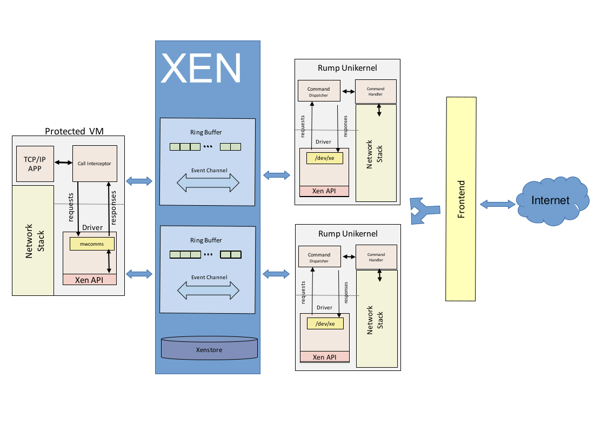
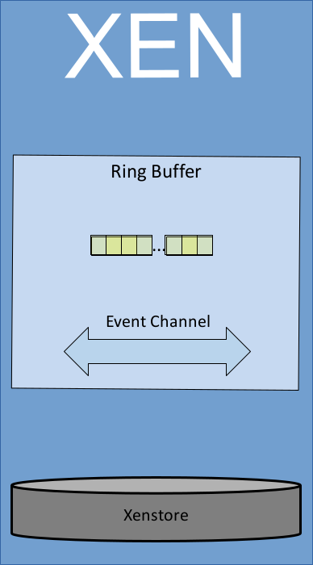
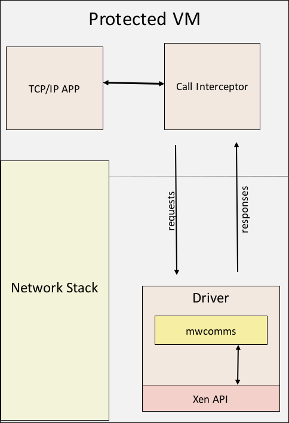
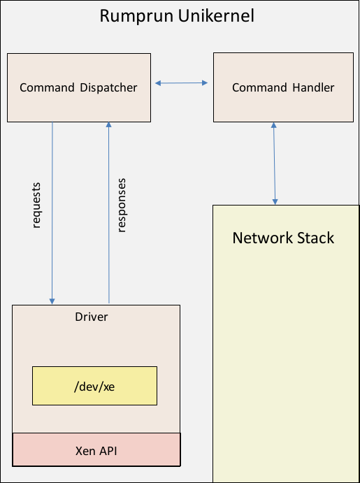

Overview
========

###### Glossary of terms

| Term    | Definition                                                                |
|:--------|:--------------------------------------------------------------------------|
| INS     | Isolated Network Stack                                                    |
| PVM     | Protected virtual machine                                                 |
| shim    | Shared libary used by LD_PRELOAD to intercept all socket related syscalls |
| NetFlow nterface | The interface responsible for reporting all protocol stack information |
| MwComms | MAGICWAND isolated network channel - all components relating to the isolated network stack including shim, PVM driver, NetFlow interface and unikernel |

Executive Summary
-----------------

## Summary of Work

Star Lab researchers successfully implemented and tested the full application agnostic isolated network stack (INS) with multiple applications including Apache HTTP Server Nginx, iperf, netcat and other various Linux network applications.

Specific accomplishments made by Star Lab include:

* Star Lab created a custom message protocol allowing one Xen domain running Linux to forward system calls to a Rumprun unikernel running as a Xen domain on the same physical system utilizing built in Xen communication capabilities.

* Star Lab wrote a Linux kernel module giving a protected virtual machine access to low level shared memory made available by Xen.

* Star Lab adapted the MwComms network isolation channel to work as a one to many mapping of one protected process to many isolated network stacks.  This required duplicating socket state across an arbitrary number of isolated network stacks.  At the writing of this report, Star Lab successfully tested the system with 10,350 simultaneous connections distributed among 23 INS instances.

* Star Lab instrumented the Netflow interface providing detailed telemetry data and deep insights into the network stack of the protected process.

* Star Lab implemented a front end virtual machine orchestration application and load balancer for creating INS instances and dynamically routing network traffic to each INS instances with the fewest connections. 

* Star Lab created a custom virtual file system to reduce ring buffer congestion and improve performance by eliminating the need for poll() function calls to send a request over the ring buffer.

* Modified Rumprun unikernel to allow over 4000 connections to one INS instance.

* Limited INS to roughly 10ms per transaction overhead in data throughput tests.

## Integration

The MwComms isolated network channel was tested to work with the TwoSix container running apache, as well as natively on Star Lab machines outside of a container.  A slowloris attack was run against the apache server running as a protected application using the INS, and the attack was observed to have worked.  Additionally, the Netflow protocol was added to the PVM kernel module and python library facilitating integration into the detection and mitigation engine.

Introduction
------------
Methods for Automatic Generalized Instrumentation of Components for Wholesale Application and Network Defense (MAGICWAND) is designed to demonstrate a groundbreaking approach to detecting low-volume, distributed denial of service (LVDDoS) attacks delivered as part of a protected operating environment for off-the-shelf applications and services. MAGICWAND was developed to meet the needs of the Technical Area 3 portion of the extreme Distributed Denial of Service (XD3) Broad Agency Announcement.  MAGICWAND can be split into two main components - the mitigation and detection engine developed by Two Six Labs and the Isolated Network Stack (INS) component developed by Star Lab.  The scope of this document is limited to the INS component of MAGICWAND and will not cover other components of the MAGICWAND system, except when referring to the parts of the system designed to interface with the detection and mitigation engine.

Unikernels are an emerging innovation for developing and deploying secure lightweight stacks that contain a minimal set of libraries, services, and code. The Rumprun unikernel is a general purpose unikernel built on top of NetBSD rump kernels that provides high quality componentized drivers, a libc, and tools to build POSIX-like code into a Rumprun unikernel. [1] The researchers at Star Lab chose the Rumprun unikernel because the built in drivers and libc allow development efforts to focus on core functionality instead of writing drivers and infrastructure that already exist while still providing many of the benefits of a unikernel.

The Xen hypervisor is a lightweight and secure virtualization technology that sits between the hardware and the operating system.  It provides strong isolation between virtual machines on the same host as well as provides a high speed shared memory communication channel, event notification channel, and procfs like interface to share data between virtual machines on the same physical host.  Xen is composed of a primary virtual machine domain called Domain 0 or Dom0, all other unprivileged virtual machine hosts are referred to as DomU's.  Domain 0 is the host from which all commands are run to create, start, stop and destroy Xen domains.

At a high-level, the MAGICWAND isolated network channel allows an arbitrary application that may be at risk for LVDDoS attacks to have all network related syscalls intercepted and forwarded to the network stack of one or more hosts. This system is called the MwComms isolated network channel and is composed of two major components: the protected virtual machine (PVM) and the isolated network stacks (INS's). The isolated network channel works by intercepting all IPv4 system calls made by the protected application and forwarding those calls over the Xen shared memory communication channel to one or more INS's where the calls are then translated and executed. Running the protected application in this manner allows for finer grained monitoring of its resource consumption, usage, and retention than could be observed otherwise.

Architecture
============

## Xen Communication Facilities

{#id .class width=150 }

The MwComms isolation channel uses three Xen features to enable communication between the different parts of the system.  First is the grant tables mechanism.  Every Xen domain has a grant table which is a list of shared memory pages and information on what domains have access to those pages. When a domain shares a page of memory with another domain, it is done through a grant reference which is an integer that indexes into the grant table and can be shared with other domains to give them access to the pages.  Next is the Xenstore, a storage space that is shared between domains for the purpose of sharing information.  Domains can place watch points on certain directories that are triggered when data is written to them, this allows for the sharing of grant refs and any other configuration data that may need to be shared with other domains.  The final major Xen feature used is the event channel, which is similar to a hardware interrupt.  An event channel is shared between domains by publishing the event channel port number to Xenstore and is associated with a ring buffer.  The event channel is signaled whenever a message is written to the ring buffer, which allows any domain interacting with the ring buffer to block waiting for messages instead polling.

## Protected Virtual machine

{#id .class width=250}

The protected virtual machine is an unprivileged domain running on top of the Xen hypervisor.  The PVM hosts the protected application, the shared library shim as well as the MwComms kernel module which is responsible for coordinating all syscalls, sending them over the Xen ring buffer, and providing the MAGICWAND detection and mitigation engine with telemetry data regarding the state of the protected application's network stack.

### Shim
The purpose of the shim is to transparently bypass the operating system network stack in favor of a direct shared-memory connection to the associated unikernel network stack.  This is done by intercepting the system calls in Table 1.4 and packing them into a MwComms message structure and writing it to the MwComms driver or by calling an ioctl to set socket parameters.  In the case of a system call needing to perform an operation on a local file descriptor or a local socket of a type other than IPv4 the calls are forwarded to the correct libraries for the operating system to handle.

|          |         |          |             |
|:---------|---------|----------|:------------|
| write    | socket  | connect  | getsockopt  |
| read     | bind    | send     | setsockopt  |
| readv    | listen  | sendto   | getsockname |
| writev   | accept  | recv     | getpeername |
| close    | accept4 | recvfrom | fcntl       |
| shutdown |         |          |             |
Table 4.1 list of functions intercepted by shim shared library

### MwComms Kernel Module

The PVM kernel module contains the majority of the logic that maintains the sate of the MwComms network isolation channel. It is responsible for setting up and sharing the grant references that compose the ring buffer, keeps track of and reports all socket information to the NetFlow channel, receives all requests from the shim, keeps track of process information and state, and receives replies from the INS and forwards them to the protected process. 

## Isolated Network Stack

{#id .class width=200 }

### Rumprun Unikernel

The Rumprun unikernel is a minimally modified NetBSD rump kernel that is able to run unmodified POSIX code as a unikernel.  The Rumprun unikernel was chosen over other unikernels to act as the isolated network stack because, as a general purpose unikernel, it has most operating system components already built in, allowing development work to focus on core application infrastructure instead of writing drivers that already exist. The unikernel component of the MwComms channel is where the commands that have been forwarded over the ring buffer are executed and responses returned.  The INS also has a driver component that allows it to interface with the Xen ring buffer.

## Frontend

The frontend script runs on domain 0 and spins up INS's and monitors the load on each one based on configurable criteria, spinning up new INS's as needed.  The frontend script also listens on port 80 and forwards traffic to INS's with available bandwidth to handle new requests.  The forwarding is done using iptables so it is fast, and reliable.

## Netflow Interface

One of the goals of the INS is to provide telemetry data and a method to change network stack behavior in real time, this is accomplished through the Netflow interface.  The Netflow interface is a listening socket in the PVM kernel module that can be interacted with to enable mitigations and receive telemetry data regarding the network stack.  The interface to the Netflow protocol is made available though a python library and as well as a python command line tool that acts as a user interface for manually interacting with the Netflow interface.

Performance
===========

Performance statistics were gathered from a Dell Optiplex 9010 with an 4 core Intel(R) Core(TM) i7-3770 CPU @ 3.40GHz 32Gb DDR3 memory and a Seagate hard drive.  The performance benchmarking tool used was ab, Apache's HTTP benchmarking tool.  Apache's ab tool was chosen because it is simple and can be run from the command line allowing easy integration into testing scripts. Additionally the page being served in the performance test is a simple static html page consisting of only a small amount of text, so more robust testing tools seemed unnecessary.

To measure performance under load, the research team at Star Lab ran ab against apache with and without the INS using increasing levels of concurrency from 1 to 500.  Concurrency is here defined as the number of connections ab has open to the target system all performing http requests.  The average at each concurrency level was calculated from a sample size of 20,000 requests.  The following table shows these results by representing average time per request in milliseconds on the vertical axis and concurrency level on the horizontal axis. Based on the best fit lines for this graph, it is estimated that by running an application using the MwComms isolated network channel, an overhead of two milliseconds with 0.27 milliseconds added per request made concurrently that is compared to apache running without the MwComms channel incurring an overhead of one millisecond with 0.19 milliseconds of overhead added per concurrent request.

The table below displays system overhead on a per request basis.  This table was taken directly from the output of the ab tool with a concurrency level of one and a sample size of ten thousand.  The percentage column indicates the percentage of requests that arrived within the amount of time indicated in the second and third columns.  For example 95 percent of all requests were received within two milliseconds when apache was being run with the INS, and one millisecond when being run without.  The bottom row's first column value 100% indicates the time taken for the longest request received during the test.  For this run, that was thirteen milliseconds for apache using the ins and three milliseconds for apache without the ins.

| Percentage | Time (ms) INS      | Time (ms) non INS       |
| ---------- | ------------------ | ----------------------- |
| 95%        | 2                  | 1                       |
| 98%        | 3                  | 1                       |
| 99%        | 5                  | 1                       |
| 100%       | 13                 | 3                       |

References
==========

[1]	A. Madhavapeddy, R. Mortier, C. Rotsos, D. Scott, B. Singh, T. Gazagnaire, S. Smith, S. Hand, and J. Crowcroft, “Unikernels: Library operating systems for the cloud,” in ACM SIGPLAN Notices, 2013, vol. 48, pp. 461–472.

END OF REPORT
=============
