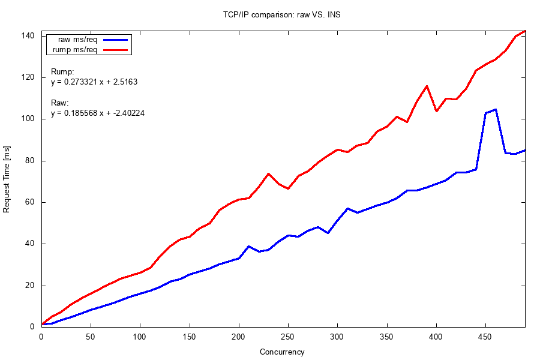

# Performance Metrics

## Concurrent Performance

Most recent measurement of the INS performance after increasing the size of the ring buffer, commit: 1e402ec6935d54a2fa81436fce6618b8c7357eac



## Non Concurrent Performance

Percentage of requests served within a certain time:

```
Command used:
ab -n 10000 -c 1 "http://<IP_ADDRESS>/"
```
Percentage of the requests served within a certain time (ms)

| Percentage | Time (ms) <br> INS | Time (ms) <br> non INS |
| ---------- | ------------------ | -----------------------|
| 50%        | 2                 | 1                      |
| 66%        | 2                 | 1                      |
| 75%        | 2                 | 1                      |
| 80%        | 2                 | 1                      |
| 90%        | 2                 | 1                      |
| 95%        | 2                 | 1                      |
| 98%        | 3                 | 1                      |
| 99%        | 5                 | 1                      |
| 100%       | 13                | 3                      |

